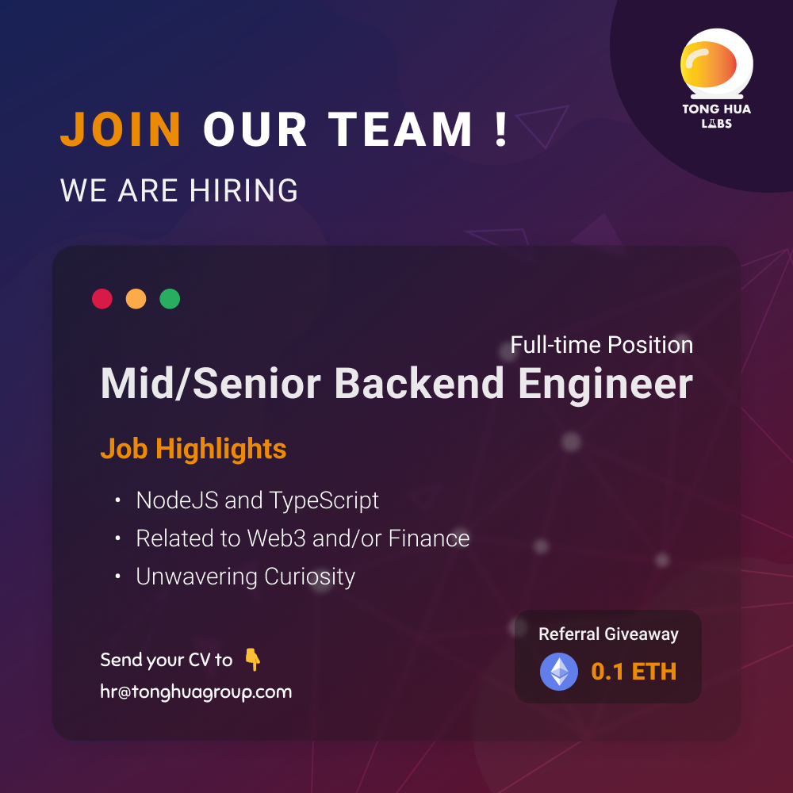

## Mid/Senior Backend Engineer (Node.js & TypeScript)

Tong Hua Holding Public Company Limited
Sampantawong
THB35,000 - 90,000 /month

## Job Highlights

- NodeJS and TypeScript
- Related to Web3 and/or Finance
- Unwavering Curiosity

## Job Description

We are looking for a trustworthy, curious, sharp, and proactive full-time Mid/Senior Backend Engineer (Node.js & TypeScript) to join our team. You'll the opportunity to design and develop innovative solutions to solve challenging problems related to Finance and/or Web3.

**What You'll Do:**

- Design, develop and maintain performant databases, libraries, and APIs using Node.js and TypeScript Integration of user-facing elements developed by front-end developers with server-side logic Collaborate with Data Engineers and Blockchain Engineers
- Implementing effective security protocols, data protection measures, and storage solutions. Recommend and implement improvements to processes and technologies.
- Writing testable, reusable, and efficient code.
- Execute automated testing platforms and system tests
- Basic Qualifications:
- Bachelor's degree in computer science, engineering, or a related field
- At least 3+ years of experience with JavaScript and Node.js
- In-depth knowledge of Node.js frameworks such as Express.js and Koa.js Proficient in data structures and algorithms
- Knowledge in IT Infrastructure — e.g., TCP/IP, NAT, Load Balancing, Reverse Proxy, etc. Knowledge in logging, measuring, security rules, and deployment strategies
- Have experience with performance, reliability, and stability optimization
- Ability to learn and adapt to new tools and technologies
- Ability to lead and complete projects independently, as well as work in a team Critical thinker and problem-solving skills
- Unwavering curiosity

 **Nice-to-haves**

- Interested in or have experience with web3 / decentralized technologies (e.g., IPFS, LIBP2P, blockchain, DAG, etc.) Extensive knowledge of front-end technologies like React, HTML, and CSS
- Experience with Graph Databases
- Experience with GraphQL
- Willing to learn Rust

## Additional Information

### Career Level

Middle

### Qualification

Degree

### Yr(s) of Exp

2 years

### Employment Type

Full Time, Permanent

### Company Website
<https://tonghuagroup.com>

### Job Function

Information Technology (IT) > Application Specialist - Software
Information Technology (IT) > Programming / Software Development

## Company Overview

**About Us**
Rooted in 1960, Tong Hua Holding Public Company Limited is a diversified Thai holding company active in Media, Technology, and Finance — Tong Hua Daily News, Tong Hua Me (Decentralized Media), Tong Hua Labs (Web3 / Blockchain R&D Lab), Tong Hua Asset, Tong Hua Capital and Tong Hua Asset Management. It was listed on the Stock Exchange o in 1991.

We are located on the historic Charoenkrung road in Bangkok, Thailand — The first modern road built in Thailand.

**Why Us?**

- We value everyone's opinions and encourage our teammates to challenge the status quo and collaborate to build innovative solutions.
- We value initiative and learning. All employees have a generous personal budget to support their continuous learning (e.g., attend conferences/workshops and access p resources of your choosing).
- Performance Bonus & Incentives to motivate employees to work towards the same goal.
- Flexible Working Hours & Casual Dress Code.
- We host company retreats because bringing the team together is something we value a lot
- We love playing and experimenting with cutting-edge technology and hope you do too!

## Additional Company Information

### Industry

Information Technology

### Benefits & Others

Education allowance, Five-day work week, Flexible working hours, Performance bonus
