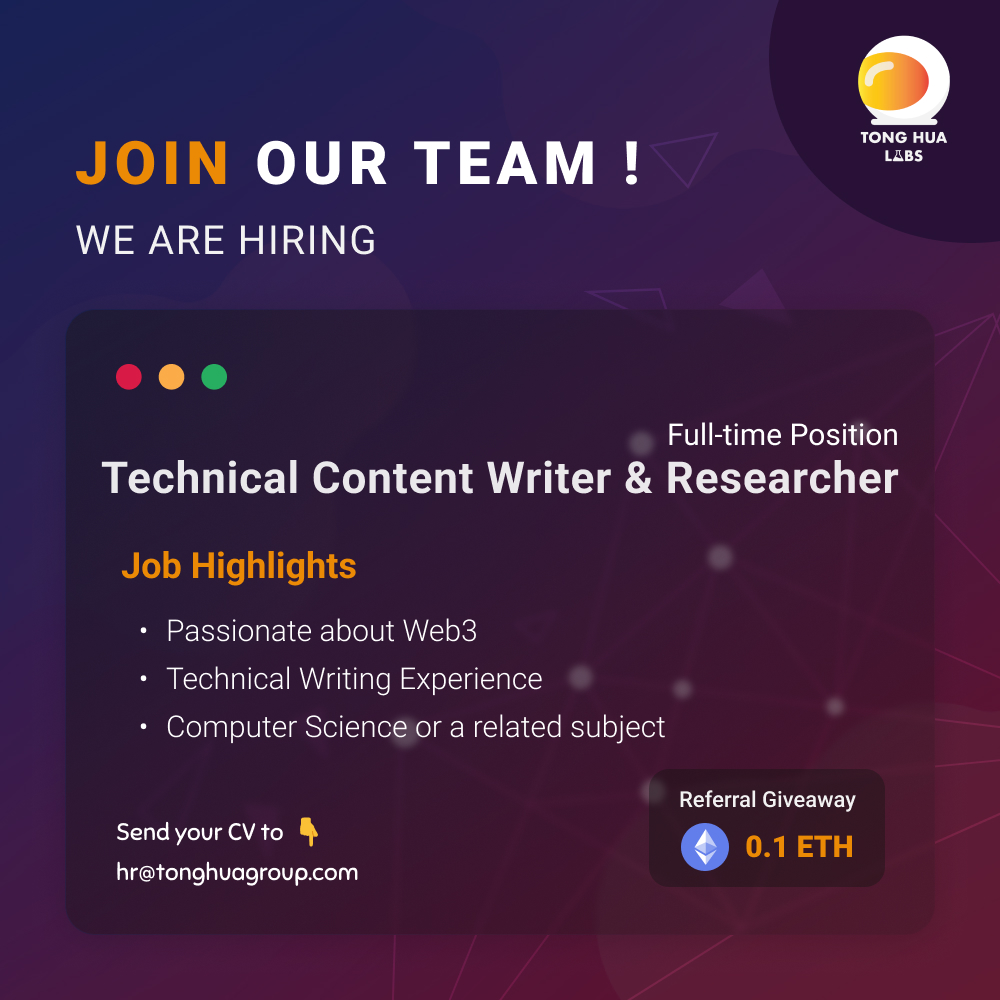

## Technical Content Writer & Researcher (Web3)/นักเขียนเชิงเทคนิค

Tong Hua Holding Public Company Limited
Sampantawong  
THB25,000 - 55,000

## Job Highlights

- Passionate about Web3  
- Technical Writing Experience
- Computer Science or a related subject

## Job Description  

Note: New graduates are welcome, and prior experience with Web3 is not required. Our team can teach and provide guidance. You will learn a lot!

We are looking for a trustworthy, curious, sharp, and proactive full-time Technical Writer & Researcher to join our team in making the internet a better place.

The individual will be accountable for researching and producing high- quality, easy-to-follow Web3-related content for technical and non-technical audiences. The content will be published to various destinations such

as Hashpire Thailand , Tong Hua Labs FB , Tong Hua Labs Youtube, our projects documentation page, and our company's internal knowledge base.

Here is a glimpse of the things you'll be learning, playing, and writing about:

- LibP2P, IPFS, IPLD, Substrate, Polkadot, Filecoin, CRDT, Proxy Re-encryption, Zero-Knowledge Proofs, Verifiable Credentials, Linked Data, Atomic Swaps, Cross-chain Communication, Cryptography, Consensus, Token Economy, Web of Trust

Are you up for the challenge of helping shape the internet? Want to become an expert on decentralized technology (Not just about blockchain but all things Web3) from a technical standpoint? Want to help raise awareness about the broken web? If so, join us, and let's make it happen together.

**What You'll Do**

- Work across teams composed of product managers, developers, designers, researchers, and marketers, to plan, research, develop, write, and maintain content (in Thai) such as documentation, product demos, tutorials, blogs, and social media posts. The content you will write ranges from the various projects we are working on to other projects that we find interesting to topics that you are personally curious about.
- Translate Technical Content from English/Mandarin to Thai.
- Collaborative P2P Learning with subject matter experts and teammates
- Manage and update a research library. Share relevant research and information with team members as it is discovered and cataloged.
- Edit, clarify, and proofread content written by others.
- Participate in the product design, development, and marketing process to provide input on issues and trends
- Connect and engage with Web3 Enthusiasts around the world

**Basic Qualifications**

- Must be extremely passionate and curious about Web3  
- A Native Thai Speaker that is proficient in English or Mandarin.
- Strong technical background, such as a degree in Computer Science or a related subject. (Ability to read code, run the protocol software, etc.)
- Prior work experience or extracurricular activities with a focus on technical writing or editing
- Desire to succeed in a technical writing & research career
- Excellent written, editing, speaking, and research skills
- Ability to make complicated subjects easy to understand
- Ability to leverage visual diagrams to explain technical architectures and flows
- Persistence and initiative to learn
- Ability to work autonomously and is a proactive and self-motivated individual.
- Ability to collaborate in a team environment, actively engage subject matter experts, and follow through on commitments

**Nice-to-haves**

- Strong mathematical foundation (e.g., Advanced Mathematics, Algebraic combinatorics, Linear Algebra, Set Theory, Graph Theory, Statistics)
- Knowledge in Computer Networking, Information Security, and Cryptography
- Knowledge in a wide variety of decentralized technologies
- Experience with developing decentralized/P2P applications
- Developer Community Building Experience  
- Graphic design skills
- Social Media Marketing skills  
- Experience using networked thought tools

## Additional Information

### Employment Type

Full Time, Permanent

### Company Website
<https://tonghuagroup.com>

### Job Function

งานการศึกษา งานวิชาการ > งานการศึกษาอื่น ๆ
งานไอที > งานไอทีอื่น ๆ
งานการตลาด งาน PR > งานการตลาดอื่น ๆ

## Company Overview

**About Us**
Rooted in 1960, Tong Hua Holding Public Company Limited is a diversified Thai holding company active in Media, Technology, and Finance — Tong Hua Daily News, Tong Hua Me (Decentralized Media), Tong Hua Labs (Web3 / Blockchain R&D Lab), Tong Hua Asset, Tong Hua Capital and Tong Hua Asset Management. It was listed on the Stock Exchange o in 1991.

We are located on the historic Charoenkrung road in Bangkok, Thailand — The first modern road built in Thailand.

**Why Us?**

- We value everyone's opinions and encourage our teammates to challenge the status quo and collaborate to build innovative solutions.
- We value initiative and learning. All employees have a generous personal budget to support their continuous learning (e.g., attend conferences/workshops and access p resources of your choosing).
- Performance Bonus & Incentives to motivate employees to work towards the same goal.
- Flexible Working Hours & Casual Dress Code.
- We host company retreats because bringing the team together is something we value a lot
- We love playing and experimenting with cutting-edge technology and hope you do too!

## Additional Company Information

### Industry

Information Technology

### Benefits & Others

Education allowance, Five-day work week, Flexible working hours, Performance bonus
