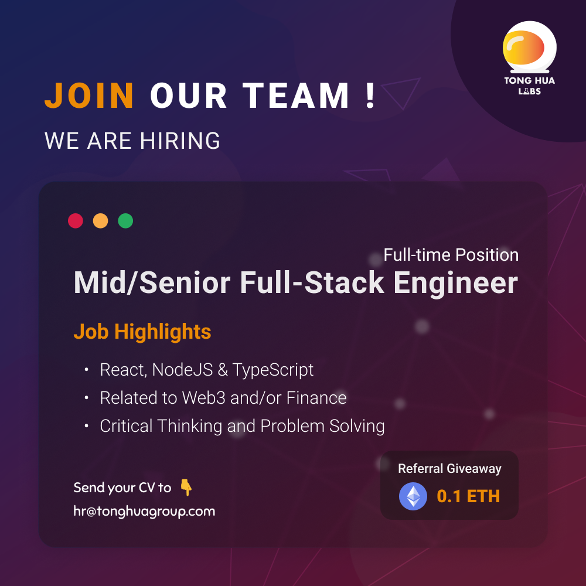

## Mid/Senior Full-Stack Engineer (React, Node.js & TypeScript)

Tong Hua Holding Public Company Limited  
Sampantawong  

## Job Highlights

- Advanced Web3 Apps with React, NodeJS & TypeScript
- Related to Web3 and/or Finance
- Creative Thinking and Problem Solving

## Job Description

We are looking for a trustworthy, curious, sharp, and proactive full-time Mid/Senior Full-Stack Engineer (React , Node.js & TypeScript) to join our team. You'll have the opportunity to design and develop innovative solutions to solve challenging problems related to Finance and/or Web3.

**What You'll Do:**

- Design and build advanced frontend applications using React and/or React Native
- Design, develop and maintain performant databases, libraries and APIs
- Work on bug fixing and improving application performance
- Continuously discover, evaluate, and implement new technologies to improve the application
- Unit-test code for robustness, including edge cases, usability, and general reliability.
- Collaborate with cross-functional teams to define, design, and ship new features.

**Basic Qualifications:**

- Bachelorʼs degree in computer science, engineering, or a related field
- 2+ years of experience in full stack development with React /  React Native and NodeJS
- Extensive knowledge of front-end tech like React, HTML and CSS
- Great understanding of React Component Lifecycle and Hooks
- Proficient in TypeScript and ES6
- Have passion for UX/UI
- In-depth knowledge of Node.js frameworks such as Express.js and Koa.js
- Proficient in data structures and algorithms
- Familiarity with database technology — e.g. MySQL, PostgresSQL and MongoDB
- Have experience with performance, reliability, and stability optimization
- Ability to learn and adapt to new tools and technologies
- Ability to lead and complete projects independently, as well as work in a team
- Critical thinker and problem-solving skills
- Unwavering curiosity

**Nice-to-haves:**

- Experience with TailwindCSS
- Experience with client-side / local storage and mobile databases
- Experience with GraphQL and Graph Databases
- Experience with React-Spring or other animation libraries
- Have published an app to Apple App Store or Google Play store
- Interested in or have experience with web3 / decentralized technologies (e.g., IPFS, LIBP2P, blockchain, DAG, etc.)
- Willing to learn Rust for backend

## Company Overview

**About Us**
Rooted in 1960, Tong Hua Holding Public Company Limited is a diversified Thai holding company active in Media, Technology, and Finance — Tong Hua Daily News, Tong Hua Me (Decentralized Media), Tong Hua Labs (Web3 / Blockchain R&D Lab), Tong Hua Asset, Tong Hua Capital and Tong Hua Asset Management. It was listed on the Stock Exchange o in 1991.

We are located on the historic Charoenkrung road in Bangkok, Thailand — The first modern road built in Thailand.

**Why Us?**

- We value everyone's opinions and encourage our teammates to challenge the status quo and collaborate to build innovative solutions.
- We value initiative and learning. All employees have a generous personal budget to support their continuous learning (e.g., attend conferences/workshops and access p resources of your choosing).
- Performance Bonus & Incentives to motivate employees to work towards the same goal.
- Flexible Working Hours & Casual Dress Code.
- We host company retreats because bringing the team together is something we value a lot
- We love playing and experimenting with cutting-edge technology and hope you do too!

## Additional Company Information

### Industry

Information Technology

### Benefits & Others

Education allowance, Five-day work week, Flexible working hours, Performance bonus
